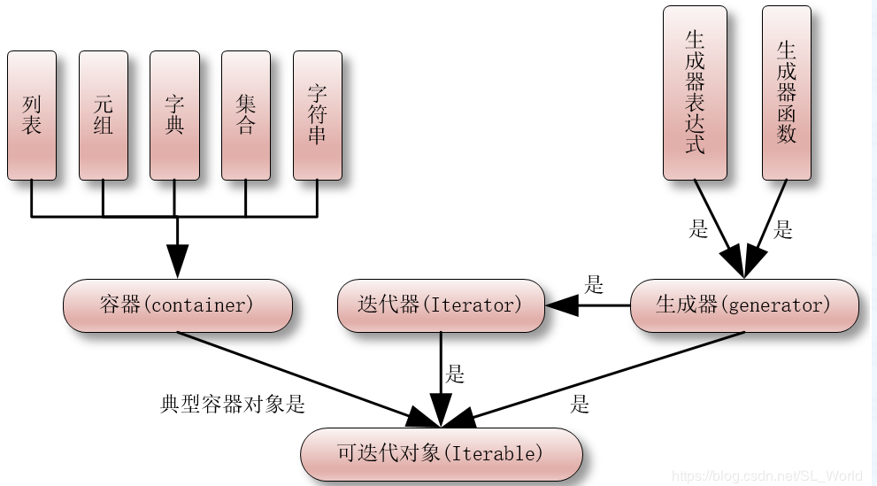

# 总体说明：
1.  可迭代对象(Iterable)
2.  迭代器(Iterator)
3.  生成器(Generator)
4.  _协程(Coroutine)（另外的话题）_

# 生成器的说明：

1. 生成器是内部使用了`yield`关键字来定义的函数，可以返回一次或多次。
2. 生成器是迭代器的一种，可以被`for...in`循环迭代。
3. 生成器是懒加载的，只有在需要的时候才会生成值。
4. 生成器是可暂停的，可以在生成值的过程中暂停，并在需要的时候继续执行。
5. 生成器是协程的实现方式之一，可以在多个任务之间切换。
***

# 迭代器的说明：
1. 可以被next()函数不断返回下一个值的对象称为迭代器：Iterator
2. 迭代器是通过iter（可迭代对象）方法创建的对象，它实现了__iter__()和__next__()方法。
3. 迭代器可以遍历可迭代对象，并依次返回其中的元素。
4. 迭代器是惰性计算的，只有在需要的时候才会计算下一个元素。
5. 迭代器是可重用的，可以多次遍历同一个可迭代对象。
6. 迭代器是协程的实现方式之一，可以在多个任务之间切换。

***

# 生成器和迭代器二者联系
1. 生成器是迭代器的一种，可以被`for...in`循环迭代。

# 可迭代对象，迭代器与生成器的关系

1. 可迭代对象（Iterable）是实现了__iter__()方法的对象，它返回一个迭代器（Iterator）。
2. 迭代器（Iterator）是实现了__next__()方法的对象，它返回下一个值。
3. 生成器（Generator）是内部使用了`yield`关键字来定义的函数，可以返回一次或多次。
4. 可迭代对象可以通过迭代器（Iterator）来遍历其中的元素。
5. 生成器可以通过生成器表达式（Generator Expression）来创建。
6. 生成器可以通过生成器函数（Generator Function）来创建。

