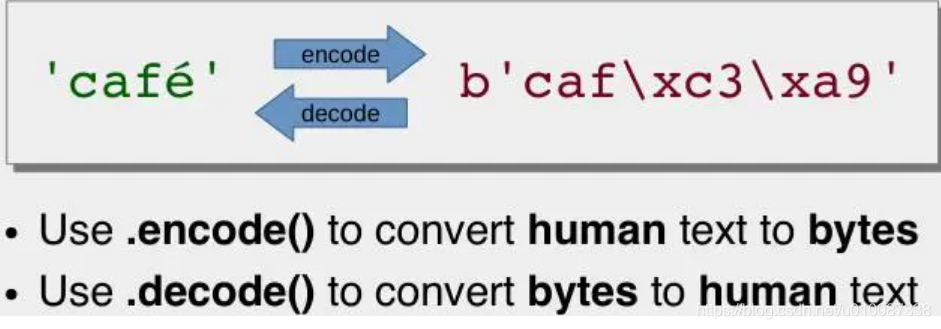
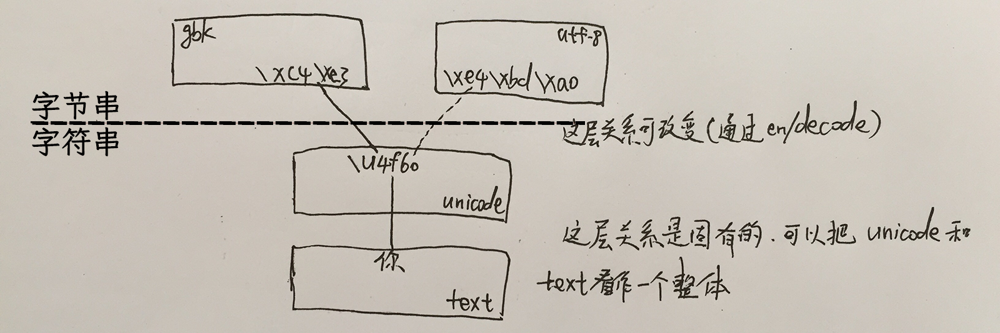

# 说明

## 字符和字节的关系
* 字符：是供“人类”查看使用的，有国际机构统一管理的字符，叫做 Unicode 字符，每个字符都有自己唯一的编码，这个叫做码点（code point），例如“北”的码点为“21271”。
* 字节：是供计算机存储和传输的。将上面提到的 Unicode 字符保存在计算机里面，可以有很多种方案，最著名的就是 UTF-8。

将字符转成字节，这个过程叫编码（encode）；而反过来将字节转成字符的过程叫做解码（decode）。

因为编码和解码的时候有多种方案，所以一个字符串可以对应多套字节串（但字符串和码点是一一对应的），如图所示：

## 其他说明
1. 字符串的切片操作在 `切片研究/string.py` 下。
