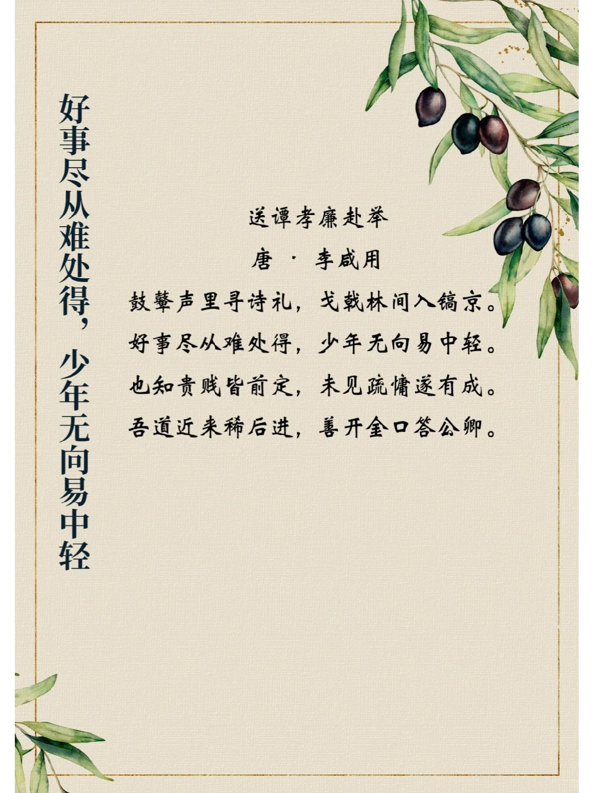
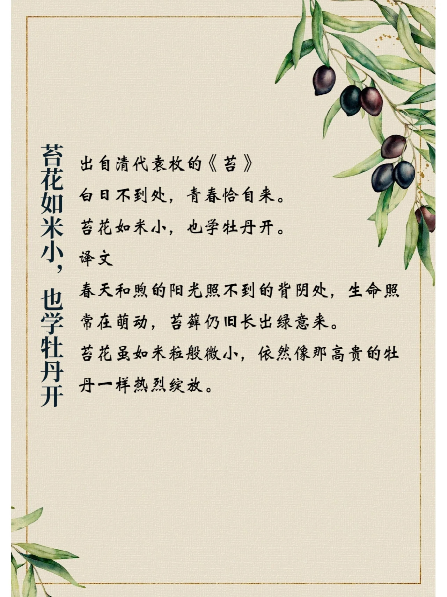

## ▌苔花如米小，也学牡丹开  
>
> 出自清代袁枚的《苔》  
> 白日不到处，青春恰自来。  
> 苔花如米小，也学牡丹开。  
> 译文  
> 春天和煦的阳光照不到的背阴处，生命照  
> 常在萌动，苔藓仍旧长出绿意来。  
> 苔花虽如米粒般微小，依然像那高贵的牡  
> 丹一样热烈绽放。  

## ▌好事尽从难处得，少年无向易中轻  
>
> 送谭孝廉赴举  
> 唐·李咸用  
> 鼓藝声里寻诗礼，戈戟林间入镐京  
> 好事尽从难处得，少年无向易中轻。  
> 也知贵贱皆前定，未见疏慵遂有成。  
> 吾道近来稀后进，善开金口答公卿。  
